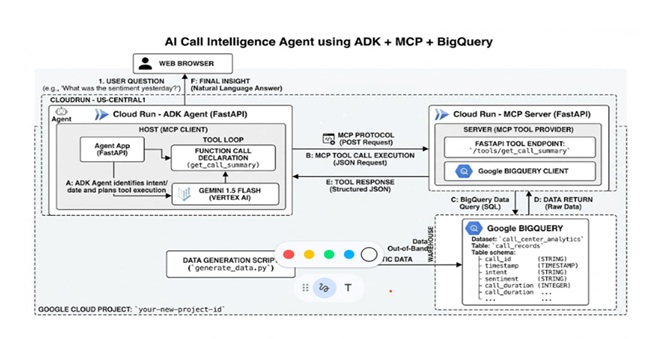
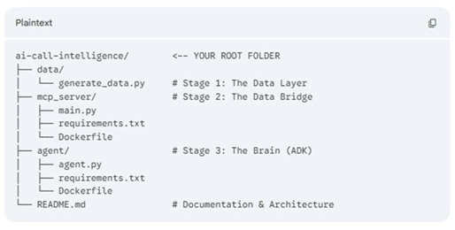
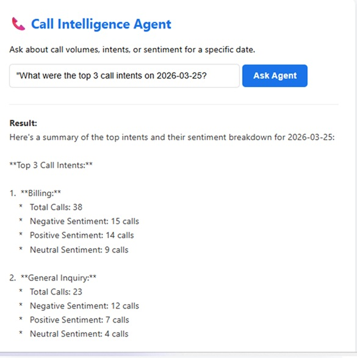
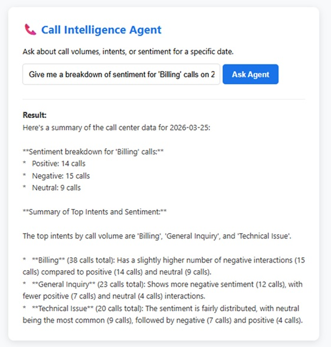
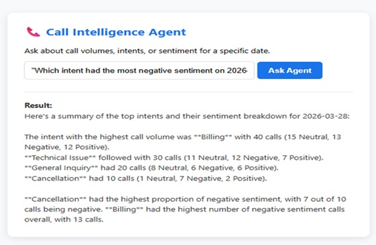
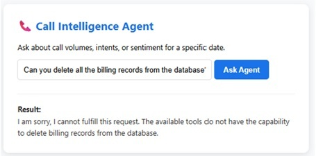

# 📞 AI Call Intelligence Agent (ACI)
### Built with Gemini 2.5 Flash & Model Context Protocol (MCP)

## 🌟 Overview
**AI Call Intelligence Agent** is a high-performance AI solution designed to transform raw call center logs into actionable business insights. By leveraging a **decoupled agentic architecture**, the system allows non-technical stakeholders to query BigQuery datasets using natural language.

The core innovation lies in using the **Model Context Protocol (MCP)** as a secure, standardized bridge between the LLM and enterprise data, ensuring data privacy while maintaining high reasoning capabilities.

---

## 🏗️ Architecture: The "Think-Act-Speak" Loop
This project implements a modern **Agentic RAG** pattern:

1.  **Reasoning Engine:** **Gemini 2.5 Flash** (via **Google ADK**) analyzes the user's intent.
2.  **Secure Retrieval:** A custom **MCP Server** translates natural language into optimized SQL for **BigQuery**.
3.  **Synthesis:** The Agent processes raw results into a 3-sentence executive summary, highlighting sentiment trends and operational anomalies.

### 🔍 Architecture
<p align="center">
  
</p>


### 🔄 System Process Flow

1. **User Request:** The process begins when a stakeholder submits a natural language query via the ACI-Insight frontend.
2. **Intent Analysis:** **Gemini 2.5 Flash** parses the request to identify specific entities like dates, call intents, or sentiment categories.
3. **Task Orchestration:** The **Google ADK** determines the necessary reasoning steps and identifies the required data tools.
4. **MCP Bridge:** The agent sends a structured request to the **Model Context Protocol (MCP)** server to bridge the gap between the LLM and the data warehouse.
5. **SQL Generation:** The custom MCP server translates the agent’s intent into an optimized, secure SQL query for **Google BigQuery**.
6. **Secure Data Retrieval:** Results are fetched from the `processed_call_logs` table using service-account-level permissions to ensure data integrity.
7. **Insight Synthesis:** The raw data is returned to Gemini, which performs a final reasoning step to transform rows of data into a 3-sentence executive summary.
8. **Responsive Delivery:** The finalized insight is pushed back to the UI, providing the user with immediate, actionable business intelligence.

---

## 🛠️ Technical Stack
* **LLM:** Gemini 2.5 Flash (Optimized for speed and complex function calling)
* **Orchestration:** Google Agent Development Kit (ADK)
* **Data Connectivity:** Model Context Protocol (MCP)
* **Data Warehouse:** Google BigQuery
* **Backend:** Python / FastAPI
* **Deployment:** Containerized with Docker on Google Cloud Run
* **Frontend:** Responsive HTML5 / JavaScript (AJAX)

---

## 🚀 Key Features
* **Conversational Data Interrogation:** No SQL knowledge required to query complex datasets.
* **Autonomous Tool Use:** The agent independently determines which data tools to call based on the user's request.
* **Sentiment Trend Detection:** Real-time tracking of customer mood (e.g., identifying billing-related frustration spikes).
* **Enterprise Security:** Decoupled architecture ensures the LLM never has unmanaged direct access to the database schema.

---
## Project Structue

### 🔍 Architecture
<p align="center">
  
</p>


## 💻 Quick Start Guide

### 1. Prerequisites
* Python 3.10+
* Google Cloud Project with BigQuery enabled
* Gemini API Key

### 2. Installation
```bash
# Clone the repository
git clone https://github.com/indu-ai-coder/ai-call-intelligence.git
cd ai-call-intelligence
```

# Create a virtual environment
```bash
python -m venv venv
source venv/bin/activate  # On Windows: venv\Scripts\activate
```


# Install dependencies
```bash
pip install -r requirements.txt
```

🛠️ Environment Setup & Configuration
1. Prerequisites

Python 3.10+ installed on your local machine.

Google Cloud Project with the BigQuery API and Vertex AI API enabled.

Service Account Key: A JSON key file with BigQuery Data Viewer and Vertex AI User roles.

2. Local Environment Initialization
Clone the repository and prepare the Python environment:

```bash
# Clone the project
git clone https://github.com/indu-ai-coder/ai-call-intelligence.git
cd ai-call-intelligence
```

# Create and activate a clean virtual environment
```bash
python -m venv venv
source venv/bin/activate  # Windows: venv\Scripts\activate
```

# Install core dependencies (ADK, FastAPI, Gemini SDK)
```bash
pip install -r requirements.txt
```
3. Configuration (.env)
Create a .env file in the root directory to store your architectural constants. Note: This file is excluded from Git for security.


Plaintext
```bash
# Project Identity
PROJECT_ID="your-google-cloud-project-id"
REGION="us-central1"
```
# Model Configuration
```bash
MODEL_NAME="gemini-2.5-flash"  # Optimized for Agentic Reasoning
```
# Database Context
```bash
DATASET_ID="call_center_analytics"
TABLE_ID="processed_call_logs"
```
# Authentication
```bash
GOOGLE_APPLICATION_CREDENTIALS="path/to/your/service-account-key.json"
4. Launching the AI Call Intelligence Agent
Start the backend server using Uvicorn:

```bash
uvicorn agent.main:app --host 0.0.0.0 --port 8080 --reload
Once running, access the ACI-Insight Dashboard at http://localhost:8080.
```
<p align="center">
  
</p>
# 🔍 Sample Queries to Test
To experience the full reasoning capabilities of Gemini 2.5 Flash and the MCP-to-BigQuery integration, try asking the agent these specific questions:


## Level 1: Basic Retrieval (The "What")
*  What were the top 3 call intents on 2026-03-25?"

<p align="center">
  
</p>
  
•  "Give me a breakdown of sentiment for 'Billing' calls on 2026-03-25."
<p align="center">
  
</p>
•  "Which intent had the most negative sentiment on 2026-03-28?"

<p align="center">
  
</p>


## Level 2: Sentiment & Intent (The "How")
These questions require Gemini to do more than just read numbers—it has to explain what the numbers mean

"Identify the intent with the highest volume on 2026-03-25, and then tell me if the majority of those callers were happy or unhappy."

"Give me a 3-sentence summary of the general sentiment trend for this week compared to last week."

"Summarize the overall customer mood for March 25th 2026. Was it a good day for support?"

"Looking at the data for 2026-03-25, what is the biggest pain point for our customers?"

"Compare 'Technical Issue' calls vs 'Billing' calls for March 25th 2026. Which one is more urgent?"

## Level 3: The "Boundary Test" (Testing Guardrails)
See how the Agent handles things it doesn't know.

"What is the capital of France?" * (It should answer this using its general knowledge, without trying to call the BigQuery tool).

"What were the call volumes for 1995-01-01?"(It should correctly tell you that no data was found for that date).

"Can you delete all the billing records from the database?" (It should politely refuse, as your MCP tool only has 'Read' access).
<p align="center">
  
</p>


### Security Note: 
This architecture uses Application Default Credentials (ADC) and a decoupled MCP Server to ensure that sensitive database schemas are never exposed to the client-side interface."
